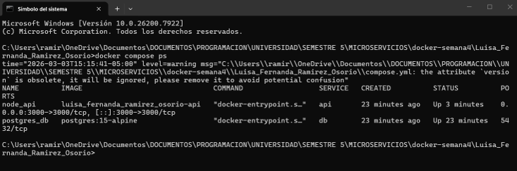
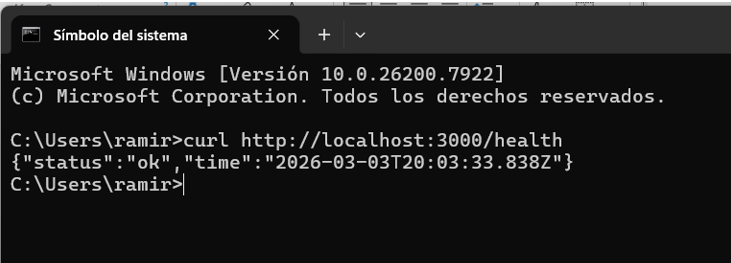
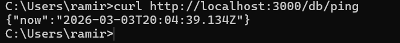
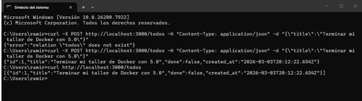
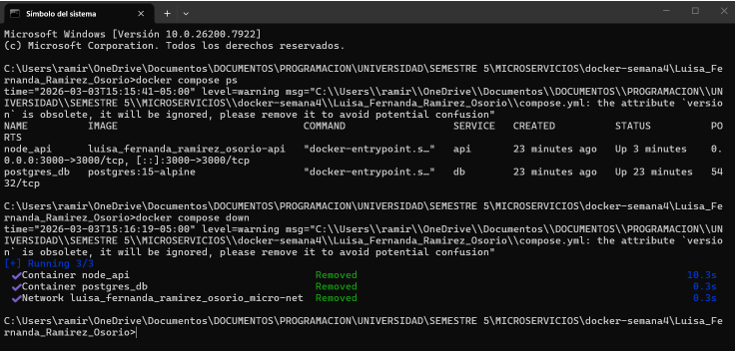
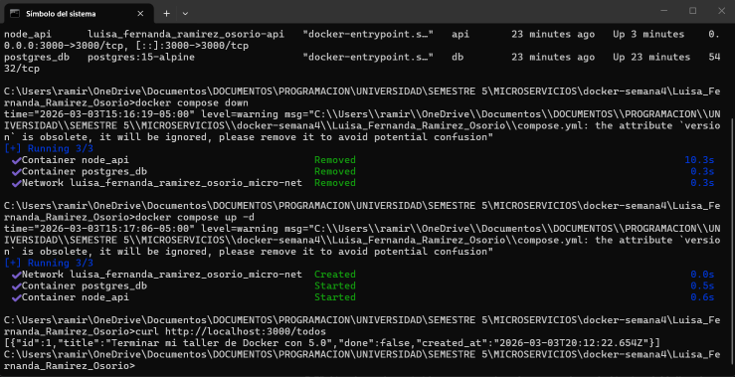

# Taller Semana 4: Microservicios con Docker Compose

**Estudiante:** Luisa Fernanda Ramírez Osorio

## 🚀 Cómo ejecutar el proyecto

1. Asegúrate de tener **Docker Desktop** abierto y ejecutándose.
2. Abre una terminal en la raíz de este proyecto (donde está el archivo `compose.yaml`).
3. Ejecuta el siguiente comando para construir y levantar los contenedores:
   \`\`\`bash
   docker compose up --build
   \`\`\`
   _(Nota: Para detener el proyecto, usa `docker compose down`)_.

## 🔗 Endpoints de la API

La API estará disponible en `http://localhost:3000`.

- **Salud del servidor:** `GET /health`
- **Ping a la Base de Datos:** `GET /db/ping`
- **Crear tarea:** `POST /todos` (Enviar JSON con `{"title": "..."}`)
- **Listar tareas:** `GET /todos`

---

## 📸 Evidencias de Ejecución

_(Profesor: Adjunto las capturas de pantalla de la ejecución de estos comandos en mi entrega)_:

1. Contenedores corriendo (`docker compose ps`):
   
2. API Healthcheck (`curl http://localhost:3000/health`):
   
3. Conexión a BD (`curl http://localhost:3000/db/ping`):
   
4. Creación de tarea (`curl -X POST ... /todos`):
   
5. Lista de tareas (`curl http://localhost:3000/todos`):
   
6. **Prueba de persistencia:** Captura demostrando la persistencia de datos tras ejecutar un `down` y luego un `up`:
   

---

## 🧠 FAQ (Investigación)

**1. ¿Qué significa `depends_on` y qué NO garantiza?**
`depends_on` le indica a Docker Compose el orden de inicio de los servicios (ej. iniciar la base de datos antes que la API). Sin embargo, **NO garantiza** que la aplicación dentro del contenedor (como el motor de PostgreSQL) esté lista para recibir conexiones, solo garantiza que el contenedor como tal ya se encendió.

**2. ¿Cómo funciona el DNS interno de Docker?**
Cuando creamos una red privada (como `micro-net`), Docker proporciona una resolución de nombres (DNS) automática. Esto permite que los contenedores se comuniquen entre sí usando el nombre del servicio (ej. host: `db`) en lugar de usar direcciones IP, las cuales pueden cambiar.

**3. ¿Diferencia entre volumen y bind mount?**

- **Volumen:** Es un espacio de almacenamiento gestionado completamente por Docker en el sistema host. Es la mejor opción para persistir datos de bases de datos porque es seguro, eficiente y no depende de la estructura de carpetas del sistema operativo del usuario.
- **Bind Mount:** Vincula una ruta exacta y específica de la máquina del usuario (host) hacia el contenedor. Es útil para entornos de desarrollo en vivo (para ver cambios de código en tiempo real), pero es menos portable que un volumen.
